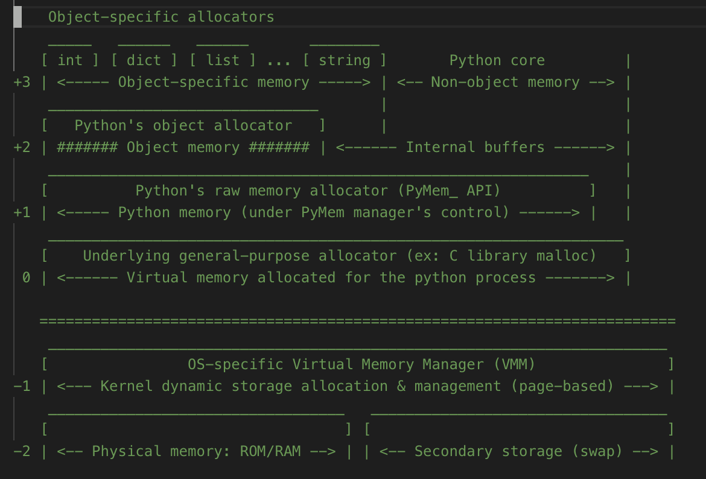
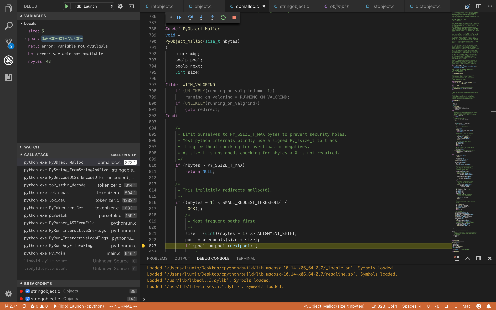
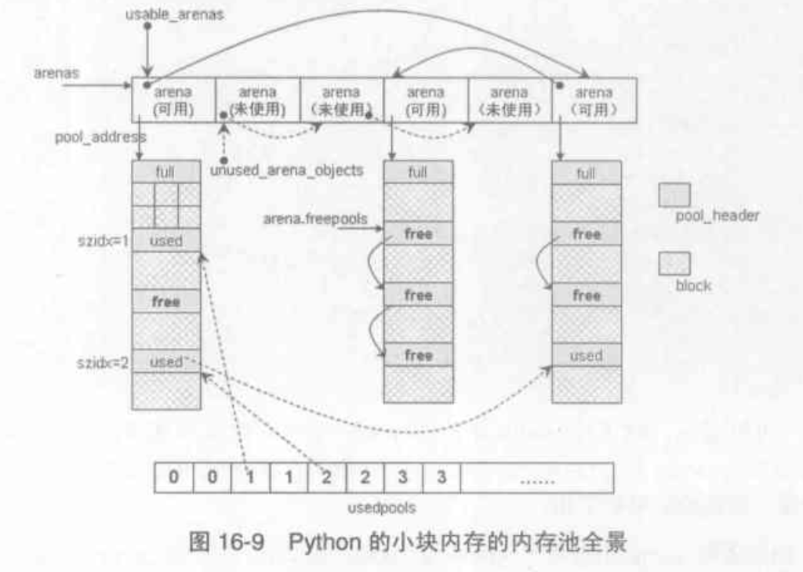
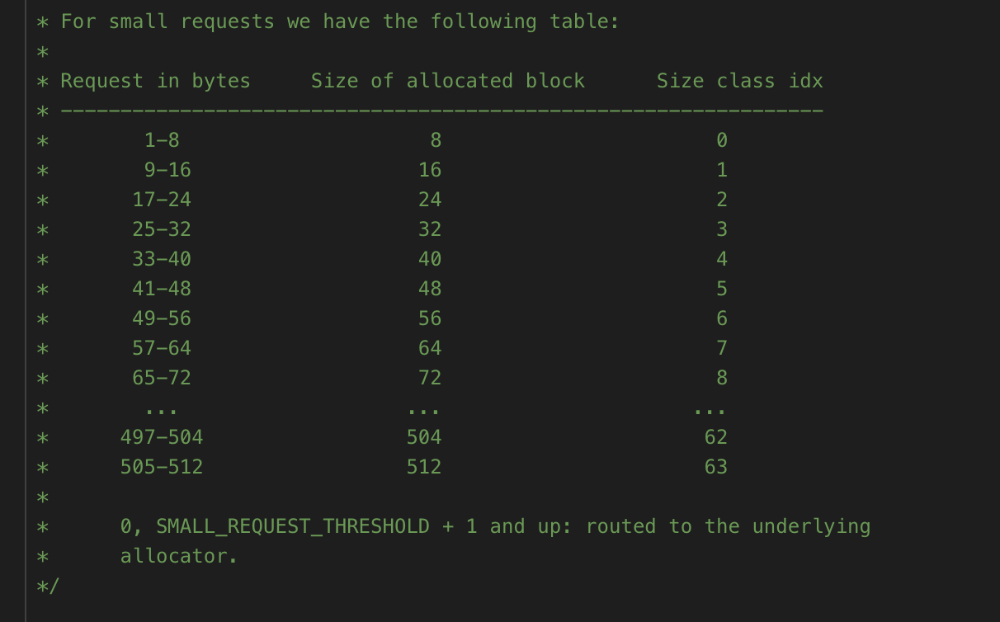

内存管理
=======
看过上一章PyObject，我们对几种基本类型有了了解，引用计数贯穿了PyObject的生命周期，而且大部分多有缓存机制。这一章我们继续深入Python的内存管理和垃圾回收机制

## Table of Contents

* [内存管理层次结构](#%E5%86%85%E5%AD%98%E7%AE%A1%E7%90%86%E5%B1%82%E6%AC%A1%E7%BB%93%E6%9E%84)
* [PyObj\_API](#pyobj_api)
* [小块内存的内存池](#%E5%B0%8F%E5%9D%97%E5%86%85%E5%AD%98%E7%9A%84%E5%86%85%E5%AD%98%E6%B1%A0)
    * [arena/pool/block](#arenapoolblock)
* [垃圾回收](#%E5%9E%83%E5%9C%BE%E5%9B%9E%E6%94%B6)
    * [标记清除](#%E6%A0%87%E8%AE%B0%E6%B8%85%E9%99%A4)
    * [分代回收](#%E5%88%86%E4%BB%A3%E5%9B%9E%E6%94%B6)
    * [整体流程](#%E6%95%B4%E4%BD%93%E6%B5%81%E7%A8%8B)
    * [weakref和\_\_del\_\_](#weakref%E5%92%8C__del__)
* [gc模块](#gc%E6%A8%A1%E5%9D%97)
    * [禁用gc](#%E7%A6%81%E7%94%A8gc)

## 内存管理层次结构



`obmalloc.c`文件头写的层次结构，从上到下

*   3层. int/string/dict/list.. 对象相关的内存管理，上一章研究的不同对象缓存池等机制
*   2层. PyObj_API，通用的object内存管理机制
*   1层. PyMem_Malloc/PyMem_Realloc/PyMem_Free简单的跨平台封装
*   0层. c语言malloc/realloc/free
*   -1层. os内核的内存管理机制
*   -2层. 硬件内存管理机制rom/ram/swap


0到-2跟python语言没多大关系，1层就是c语言简单封装
```
#define PyMem_MALLOC(n)     ((size_t)(n) > (size_t)PY_SSIZE_T_MAX ? NULL \
                : malloc(((n) != 0) ? (n) : 1))
#define PyMem_REALLOC(p, n) ((size_t)(n) > (size_t)PY_SSIZE_T_MAX  ? NULL \
                : realloc((p), ((n) != 0) ? (n) : 1))
#define PyMem_FREE      free
```
PyMem_API提供了宏和函数两套接口，是为了给c扩展用函数的类型检查，功能是一样的

3层是上一章研究过的， 所以这一章的重点是第2层，Python通用的object内存管理机制


## PyObj_API
先看看调用栈，怎样通过第3层调用到第2层的PyObj_API。

从int开始，我发现int的初始化直接用PyMem_API，应该是因为fill_free_list直接接管了int的内存分布，参考上一章。
所以我们只能从str开始看
```
>>>> a = 'abcd'
```

初始化PyStringObject时，调用到了PyObject_Malloc，正是PyObject_API中提供了一整套与对象类型无关的内存池机制。

其实，内存池只容纳**"小块内存"**，python中默认的小于512bytes
```
void *
PyObject_Malloc(size_t nbytes)
{
    ....
    if (nbytes > PY_SSIZE_T_MAX)
        return NULL;
    ...
    if ((nbytes - 1) < SMALL_REQUEST_THRESHOLD) {
        ....
        return
    }
redirect:
    if (nbytes == 0)
        nbytes = 1;
    return (void *)malloc(nbytes);
}
```
`PyObject_Malloc`是个超长的函数，大部分都在处理小块内存的逻辑，最外层很简单

1. 检查size超大溢出
2. 小块内存缓存池逻辑
3. 大块内存直接malloc

注：一些异常情况也会goto redirect然后直接malloc，最小1byte是兼容跨平台

## 小块内存的内存池



整体结构如上
```
arena -- pool -- block
```
让我们自底向上分析

*   block 是固定大小的内存块，内存对齐
*   pool  4096bytes，跟一页内存一致，装着一堆统一大小的block
*   arena 默认256kb，装着一个pool数组，这些pool可以有不同的blocksize


[obmalloc.c]  


block 固定size-sizeidx，内存对齐


### arena/pool/block
```
/* Pool for small blocks. */
struct pool_header {
    union { block *_padding;
            uint count; } ref;          /* number of allocated blocks    */
    block *freeblock;                   /* pool's free list head         */
    struct pool_header *nextpool;       /* next pool of this size class  */
    struct pool_header *prevpool;       /* previous pool       ""        */
    uint arenaindex;                    /* index into arenas of base adr */
    uint szidx;                         /* block size class index        */
    uint nextoffset;                    /* bytes to virgin block         */
    uint maxnextoffset;                 /* largest valid nextoffset      */
};
```
`PyObject_Malloc`中初始化`pool_header`，并返回第一个block
```
    ...
    pool->szidx = size;
    size = INDEX2SIZE(size);
    bp = (block *)pool + POOL_OVERHEAD;
    pool->nextoffset = POOL_OVERHEAD + (size << 1);
    pool->maxnextoffset = POOL_SIZE - size;
    pool->freeblock = bp + size;
    *(block **)(pool->freeblock) = NULL;
    UNLOCK();
    return (void *)bp;
    ...
```

`arenas`双向链表维护`area_object`对象
```
/* Array of objects used to track chunks of memory (arenas). */
static struct arena_object* arenas = NULL;
/* Number of slots currently allocated in the `arenas` vector. */
static uint maxarenas = 0;

/* Record keeping for arenas. */
struct arena_object {
    uptr address;
    /* Pool-aligned pointer to the next pool to be carved off. */
    block* pool_address;
    uint nfreepools;
    uint ntotalpools;
    /* Singly-linked list of available pools. */
    struct pool_header* freepools;
    // arena的双向链表
    struct arena_object* nextarena;
    struct arena_object* prevarena;
};
```

*   pool是连续内存，申请的时候就整个4kb一起申请了
*   arena用指针指向pool的数组，用到的时候才去申请pool数组占据的内存

对于PyObject_Malloc，不直接跟area和pool结构打交道，而是跟这个usedpools:

1. 申请内存，从usedpools里面找size对应的可用pool
2. 没有pool，去申请arena，并加入arenas数组
3. 拿到了pool去使用block
4. 释放内存时归还block，维护pool状态
5. 如果一个arena中的pool都是empty，释放该arena指向的pool数组，释放arena

## 垃圾回收

c/c++ 中需要手动管理内存，精确但是很大负担，所以新的语言中大多有垃圾回收机制。

引用计数是python主要的内存管理机制，相对于其他技术（比如标记清除），优点是实时性，立即回收，可控。
缺点是额外操作和频繁申请释放带来的效率问题，所以大量采用内存缓存池。

另一个缺陷是循环引用，python采用了分代回收和标记清除来处理循环引用。

### 标记清除
```
>>> a = []
>>> b = []
>>> a.append(b)
>>> b.append(a)
>>> a
[[[...]]]
>>> b
[[[...]]]
```
**能有循环引用的，必定是容器对象**（比如`list/dict/__dict__/..`)

容器对象的Malloc会增加一个PyGC_Head，用于gc模块track
```
[gcmodule.c]
PyObject *
_PyObject_GC_Malloc(size_t basicsize)
{
    PyObject *op;
    PyGC_Head *g;

    g = (PyGC_Head *)PyObject_MALLOC(
        sizeof(PyGC_Head) + basicsize);

    g->gc.gc_refs = GC_UNTRACKED;
    generations[0].count++; /* number of allocated GC objects */
    if (generations[0].count > generations[0].threshold &&
        enabled &&
        generations[0].threshold &&
        !collecting &&
        !PyErr_Occurred()) {
        collecting = 1;
        collect_generations();
        collecting = 0;
    }
    op = FROM_GC(g);
    return op;
}
```

```
[objimpl.h]
/* GC information is stored BEFORE the object structure. */
typedef union _gc_head {
    struct {
        union _gc_head *gc_next;
        union _gc_head *gc_prev;
        Py_ssize_t gc_refs;
    } gc;
    double dummy; /* Force at least 8-byte alignment. */
    char dummy_padding[sizeof(union _gc_head_old)];
} PyGC_Head;
```
用标记清除，关键是要找到循环引用的容器对象，一句话版本：

（引用计数-循环引用计数）不为0，则有非循环引用不能释放；再找到它引用的对象，也不能释放；其他的都释放


具体步骤如下

1. 对于每一个容器对象, 设置一个gc_refs值, 并将其初始化为该对象的引用计数值. 
2. 对于每一个容器对象, 找到所有其引用的对象, 将被引用对象的gc_refs值减1. 
3. 执行完步骤2以后所有gc_refs值还大于0的对象都被非容器对象引用着, 至少存在一个非循环引用. 因此不能释放这些对象, 将他们放入另一个集合, 都是rootObject.
4. 在步骤3中不能被释放的rootObject开始, 如果他们引用着某个对象, 被引用的对象也是不能被释放的, 因此将这些 对象也放入另一个集合中. 
5. 此时还剩下的对象都是无法到达的对象. 现在可以释放这些对象了.

### 分代回收
根据weak generational hypothesis：
> 越年轻的对象死的越快（需要回收），越老的对象存活越久

python中分3代
```
#define NUM_GENERATIONS 3
#define GEN_HEAD(n) (&generations[n].head)

/* linked lists of container objects */
static struct gc_generation generations[NUM_GENERATIONS] = {
    /* PyGC_Head,                               threshold,      count */
    {{{GEN_HEAD(0), GEN_HEAD(0), 0}},           700,            0},
    {{{GEN_HEAD(1), GEN_HEAD(1), 0}},           10,             0},
    {{{GEN_HEAD(2), GEN_HEAD(2), 0}},           10,             0},
};
```
所有新创建的对象都分配为第0代. 当这些对象 经过一次垃圾回收仍然存在则会被放入第1代中. 如果第1代中的对象在一次垃圾回收之后仍然存货则被放入第2代. 

对于不同代的对象Python的回收的频率也不一样. 可以通过gc.set_threshold(threshold0[, threshold1[, threshold2]]) 来定义. 默认值如上.

当Python的垃圾回收器中新增的对象数量减去删除的对象数量大于threshold0时, Python会对第0代对象 执行一次垃圾回收. 每当第0代被检查的次数超过了threshold1时, 第1代对象就会被执行一次垃圾回收. 同理每当 第1代被检查的次数超过了threshold2时, 第2代对象也会被执行一次垃圾回收.


### 整体流程
具体可以通过`collect`函数来了解
```
[gcmodule.c]
/* This is the main function.  Read this to understand how the
 * collection process works. */
static Py_ssize_t collect(int generation)
```
总体而言:

*   先处理分代，确定要回收的generation
*   再用标记清除标记该generation中的非循环引用，再清除所有循环引用


### weakref和__del__
对于垃圾回收，有两个非常重要的术语，那就是**reachable**与**collectable**，当然还有与之对应的unreachable与uncollectable，代码中大量出现。 

reachable是针对python对象而言，如果从根集（root）能到找到对象，那么这个对象就是reachable，与之相反就是unreachable，事实上就是只存在于循环引用中的对象，Python的垃圾回收就是针对unreachable对象。 

而collectable是针对unreachable对象而言，如果这种对象能被回收，那么是collectable；如果不能被回收，即循环引用中的对象定义了__del__，那么就是uncollectable。Python垃圾回收对uncollectable对象无能为力，会造成事实上的内存泄露。


collect函数后面部分，可以看到最下面对weakref和__del__有特殊处理

*   weakref 会正确的清理掉，并触发回调
*   __del__则不能正常清理，实际上真的会造成内存泄露，注释里面也说了不要这样做，否则程序员自行处理

```
[gcmodule.c]
/* This is the main function.  Read this to understand how the
 * collection process works. */
static Py_ssize_t collect(int generation)
    ...
    /* Clear weakrefs and invoke callbacks as necessary. */
    m += handle_weakrefs(&unreachable, old);
    ...
    /* Append instances in the uncollectable set to a Python
     * reachable list of garbage.  The programmer has to deal with
     * this if they insist on creating this type of structure.
     */
    handle_finalizers(&finalizers, old);
```

## gc模块

``gcmodule.c``被暴露在python中的gc模块，具体接口看gc的文档，这里简单提几个

- gc.enable(); gc.disable(); gc.isenabled()

    开启gc（默认情况下是开启的）；关闭gc；判断gc是否开启

- gc.collect([generation])

    执行一次gc

- gc.set_threshold(t0, t1, t2); gc.get_threshold()

    设置垃圾回收阈值； 获得当前的垃圾回收阈值
    注意：gc.set_threshold(0)也有禁用gc的效果

- gc.get_objects()

    返回所有被垃圾回收器（collector）管理的对象。只要python解释器运行起来，就有大量的对象被collector管理，因此，该函数的调用比较耗时！

- gc.get_referents(*obj)
    
    返回obj对象直接指向的对象

- gc.get_referrers(*obj)

    返回所有直接指向obj的对象

- gc.set_debug(flags)

    设置调试选项，非常有用

下面我们观察一下简单的gc过程
```
>>> class A(object):
...     pass
... 
>>> a = A()
>>> del a
>>> gc.collect()
gc: collecting generation 2...
gc: objects in each generation: 11 0 3490
gc: done, 0.0009s elapsed.
0
```
什么都没有发生，因为被引用计数清除掉了

```
>>> a = A()
>>> a.b = a
>>> del a
>>> gc.collect()
gc: collecting generation 2...
gc: objects in each generation: 6 0 3496
gc: collectable <A 0x106729a90>
gc: collectable <dict 0x106731b40>
gc: done, 2 unreachable, 0 uncollectable, 0.0009s elapsed.
2
```

自己跟自己循环引用，然后就走到了gc，2个unreachable都被清除了

```
>>> class B(object):
...     def __del__(self):
...             print("del B")
... 
>>> b = B()
>>> del b
del B
>>> b = B()
>>> b.c = b
>>> del b
>>> gc.collect()
gc: collecting generation 2...
gc: objects in each generation: 19 0 3495
gc: uncollectable <B 0x106729990>
gc: uncollectable <dict 0x106731910>
gc: done, 2 unreachable, 2 uncollectable, 0.0010s elapsed.
2
```

class定义了__del__之后，无循环引用时引用计数一切正常
有循环引用，gc就失效了，uncollectable内存泄露，所以尽量用weakref替代__del__

### 禁用gc

游戏引擎里面经常会禁用python的gc，由引擎自己管理gc
```
gc.disable()
```

附一片很有名的文章：
> [《禁用Python的GC机制后，Instagram性能提升10%》](
http://www.infoq.com/cn/articles/disable-python-gc-mechanism-instagram-performance-increase)