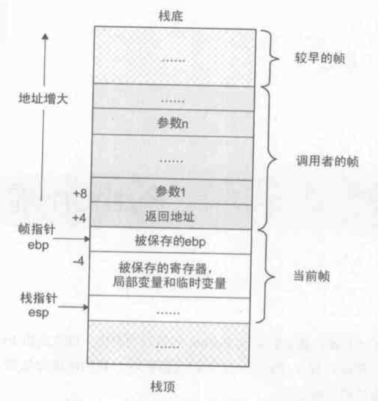
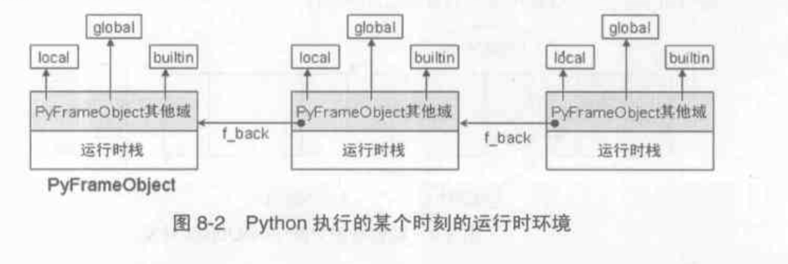
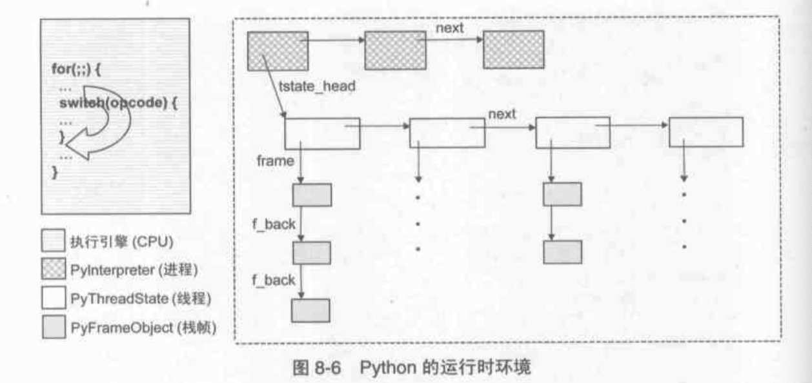

Python虚拟机
===========

> 刘欣 2018.11.21


## 编译

都说Python是解释型语言，其实也有一个简单的编译过程，然后解释执行，类似java和c#。

### pyc

`.py`文件执行前会编译成`.pyc`，再由python虚拟机解释执行。只是在我们执行`.py`脚本时，这个过程被隐藏了，缓存下了`.pyc`下次使用。

pyc文件包含了创建时间，与py文件的修改时间对比就能同步最新的代码


### PyCodeObject

更准确的说，`.py`文件被编译成PyCodeObject，由虚拟机执行，并保存为`.pyc`缓存下来。来看看PyCodeObject的定义

```
[code.h]

/* Bytecode object */
typedef struct {
    PyObject_HEAD
    int co_argcount;        /* #arguments, except *args */
    int co_nlocals;     /* #local variables */
    int co_stacksize;       /* #entries needed for evaluation stack */
    int co_flags;       /* CO_..., see below */
    PyObject *co_code;      /* instruction opcodes */
    PyObject *co_consts;    /* list (constants used) */
    PyObject *co_names;     /* list of strings (names used) */
    PyObject *co_varnames;  /* tuple of strings (local variable names) */
    PyObject *co_freevars;  /* tuple of strings (free variable names) */
    PyObject *co_cellvars;      /* tuple of strings (cell variable names) */
    /* The rest doesn't count for hash/cmp */
    PyObject *co_filename;  /* string (where it was loaded from) */
    PyObject *co_name;      /* string (name, for reference) */
    int co_firstlineno;     /* first source line number */
    PyObject *co_lnotab;    /* string (encoding addr<->lineno mapping) See
                   Objects/lnotab_notes.txt for details. */
    void *co_zombieframe;     /* for optimization only (see frameobject.c) */
    PyObject *co_weakreflist;   /* to support weakrefs to code objects */
} PyCodeObject;
```

每一个code block，或者说每一个命名空间，就编译成一个PyCodeObject。其中每一项的定义，看注释差不多能猜出来。

写入pyc的过程，基本就是把各个对象序列化成字节流。

PyCodeObject包含的子block的PyCodeObject会形成嵌套，存在co_consts里面，最终一起写入

最终执行的是字节码指令序列opcode，定义在`opcode.h`中，共有100多个指令


### 解析pyc

在python中用`compile`可以得到`code`对象，就是PyCodeObject对象

```
>>> source = """
... def add(x, y):
...     return x + y
... """
>>> 
>>> co = compile(source, "test.py", "exec")
>>> dir(co)
['__class__', '__cmp__', '__delattr__', '__doc__', '__eq__', '__format__', '__ge__', '__getattribute__', '__gt__', '__hash__', '__init__', '__le__', '__lt__', '__ne__', '__new__', '__reduce__', '__reduce_ex__', '__repr__', '__setattr__', '__sizeof__', '__str__', '__subclasshook__', 'co_argcount', 'co_cellvars', 'co_code', 'co_consts', 'co_filename', 'co_firstlineno', 'co_flags', 'co_freevars', 'co_lnotab', 'co_name', 'co_names', 'co_nlocals', 'co_stacksize', 'co_varnames']
>>> co.co_consts
(<code object add at 0x1048aeab0, file "test.py", line 2>, None)
```

通过co_consts可以拿到def的add函数的code对象
```
>>> func_code = co.co_consts[0]
>>> func_code.co_name
'add'
>>> func_code.co_argcount
2
>>> func_code.co_code
'|\x00\x00|\x01\x00\x17S'
>>> func_code.co_varnames
('x', 'y')
```

在通过内建的dis模块，可以拿到指令信息
```
>>> import dis
>>> dis.dis(func_code)
  3           0 LOAD_FAST                0 (x)
              3 LOAD_FAST                1 (y)
              6 BINARY_ADD          
              7 RETURN_VALUE
```

通过字节码指令，很容易就能猜到虚拟机的执行步骤了。


## 执行环境

一般的可执行文件，运行时的栈大概是这样



从栈底到栈顶一层层调用，子函数调用结束后出栈，回到调用的父函数栈帧。

而python虚拟机中并不是直接用了os的栈帧，而是有自己的模拟PyFrameObject。


### PyFrameObject

PyFrameObject其实包含了栈帧和当前帧的执行环境

```
[frameobject.h]

typedef struct _frame {
    PyObject_VAR_HEAD
    struct _frame *f_back;  /* previous frame, or NULL */
    PyCodeObject *f_code;   /* code segment */
    PyObject *f_builtins;   /* builtin symbol table (PyDictObject) */
    PyObject *f_globals;    /* global symbol table (PyDictObject) */
    PyObject *f_locals;     /* local symbol table (any mapping) */
    PyObject **f_valuestack;    /* points after the last local */
    PyObject **f_stacktop;
    PyObject *f_trace;      /* Trace function */
    PyObject *f_exc_type, *f_exc_value, *f_exc_traceback;
    PyThreadState *f_tstate;
    int f_lasti;        /* Last instruction if called */
    int f_lineno;       /* Current line number */
    int f_iblock;       /* index in f_blockstack */
    PyTryBlock f_blockstack[CO_MAXBLOCKS]; /* for try and loop blocks */
    PyObject *f_localsplus[1];  /* locals+stack, dynamically sized */
} PyFrameObject;
```

通过f_back指针，frameObject形成链表，也就是模拟os的调用栈（esp/ebp栈底栈顶指针）

  

另外我们可以看到f_code是一个PyCodeObject，所以PyFrameObject和PyCodeObject是一一对应的。

在python中同样可以访问`frame`对象

```
>>> frame = sys._getframe()
>>> caller = frame.f_back
```


## 命名空间

python中的所有变量其实都是名字，一个名字指向一个对象

module、function、class都会形成各自的命名空间，一层层嵌套，最内层的最优先

### LGB规则

简化的作用域规则，就是local-global-builin逐步查找，优先级依次降低，其中：

*   local是函数作用域
*   global是module的作用域
*   builtin就是python builtin的作用域

### 闭包

当函数嵌套的时候，会把函数直接外层的作用域跟函数捆绑起来，形成闭包

所以这个规则也成为LEGB，E就是enclosing

要注意的是：**作用域仅由文本**决定，也就是定义函数的时候

所以闭包取的是函数定义时（或者说编译时）的作用域，而不是函数执行时的，例子：

```
def f():
    a = 2
    def g():
        print a
    return g

a = 1
func = f()
func()
```


### global语句

看一个之前很难理解的例子

```
a = 1

def g():
    print a

def f():
    print a
    a = 2
    print a

g()
f()
```

在`f()`的第一句话会报错
```
1
Traceback (most recent call last):
  File "/Users/liuxin/Documents/dev/pysourcenote/test.py", line 12, in <module>
    f()
  File "/Users/liuxin/Documents/dev/pysourcenote/test.py", line 7, in f
    print a
UnboundLocalError: local variable 'a' referenced before assignment
```

原因同样是上面的注意点：**作用域仅由文本**决定，也就是定义函数的时候

在`f()`定义的时候，`a=2`决定了`a`在local作用域，所以第一句`print a`就报错了。

理解了这一点，global的真正意义就理解了：**表明在当前block中变量是global作用域的**


### PyEval_EvalFrameEx

虚拟机执行的一个重要函数，

```
[ceval.c]

PyEval_EvalFrameEx(PyFrameObject *f, int throwflag)
```

基本步骤就是从PyFrameObject中取出变量，建立执行环境，然后取出PyCodeObject中的指令，逐条执行。

这是一个超长的函数，一个大的for循环，逐条解析指令。然后一个大的switch，判断是100+种指令中的哪一种，然后取出参数进行执行操作。

另有一个why变量值得注意，why记录了当前函数的退出原因，可能是异常或者其他的流程退出。

```
[ceval.c]

/* Status code for main loop (reason for stack unwind) */
enum why_code {
        WHY_NOT =       0x0001, /* No error */
        WHY_EXCEPTION = 0x0002, /* Exception occurred */
        WHY_RERAISE =   0x0004, /* Exception re-raised by 'finally' */
        WHY_RETURN =    0x0008, /* 'return' statement */
        WHY_BREAK =     0x0010, /* 'break' statement */
        WHY_CONTINUE =  0x0020, /* 'continue' statement */
        WHY_YIELD =     0x0040  /* 'yield' operator */
};
```

### 运行时框架


os的进程和线程模型，这里假设大家都知道。python对os的源生进程和线程分别进行了封装，原理其实差不多。那么整体架构如下




两个重要的对象`PyInterpreterObject`和`PyThreadState`，分别是进程和线程的运行时状态。

每个线程有自己的stack，也就是PyFrameObject的链表。

每个frame中`PyEval_EvalFrameEx`逐条执行opcode。


